# Homlie App

A customer facing application that allows them to schedule and request for home-based services from workers nearby the region.

Three core services:
-House Cleaning
-Laundry
-Cooking

Key features include:
Sqlite
Phone number authentication
Google maps
Mpesa STK implementation
Custom cost calculator
Firebase implementation-real time push notifications etc

# Screen shots:
## Intro  
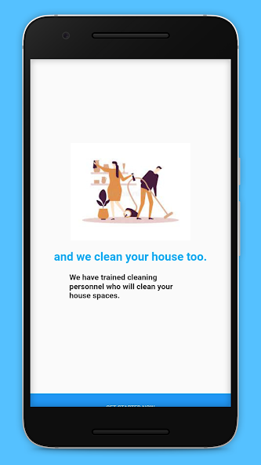  
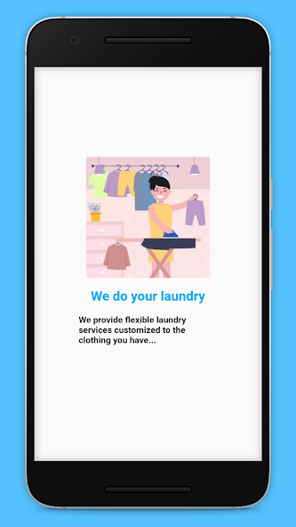  
  
## Login  
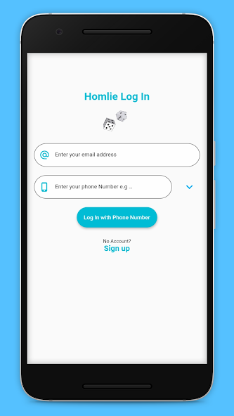  
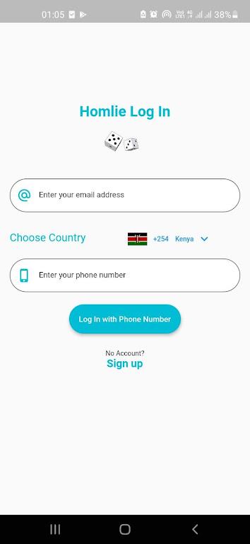  
## Landing  
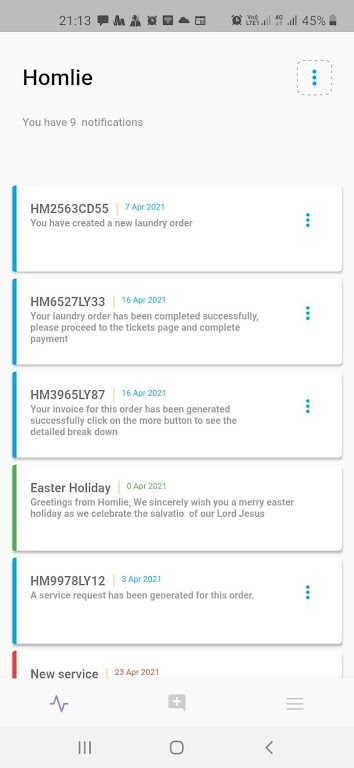  
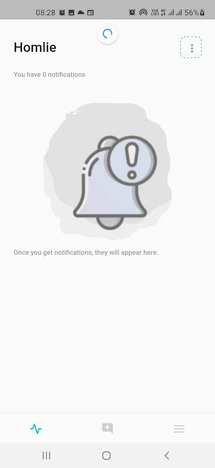  
## Laundry  
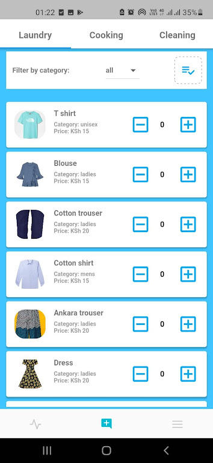  
## Cleaning  
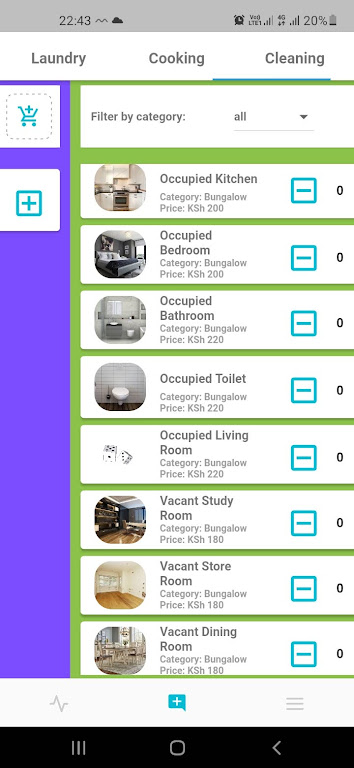  
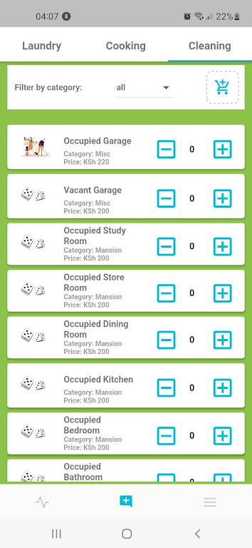  
## Cooking  
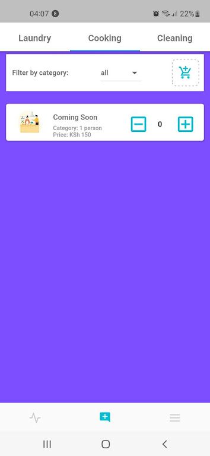  
## Checkout  
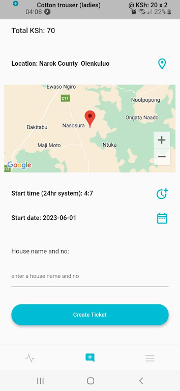  
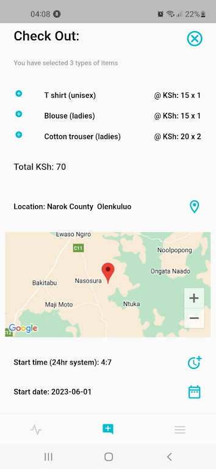  
## Tickets  
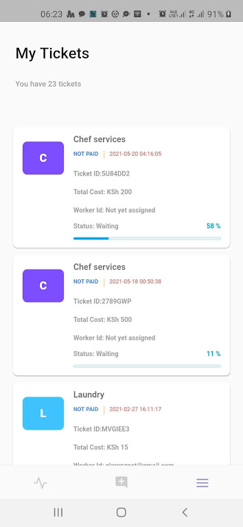  
