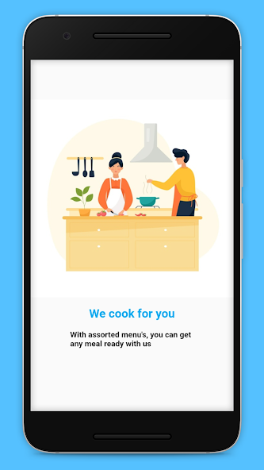

# Homlie App  

### <i>Playstore link: https://play.google.com/store/apps/details?id=com.luns.neuro.mlkn</i>  

A customer facing application that allows them to schedule and request for home-based services from workers nearby the region.  

Three core services: 
-House Cleaning 
-Laundry 
-Cooking  

Key features include: 
-Sqlite 
-Phone number authentication 
-Google maps 
-Mpesa STK implementation 
-Custom cost calculator 
-Firebase implementation-real time push notifications etc  

# Screen shots:
## Intro  
  
  
   
## Login  
  
   
## Landing  
  
   
## Laundry  
   
## Cleaning  
  
   
## Cooking  
   
## Checkout  
  
   
## Tickets  
   
